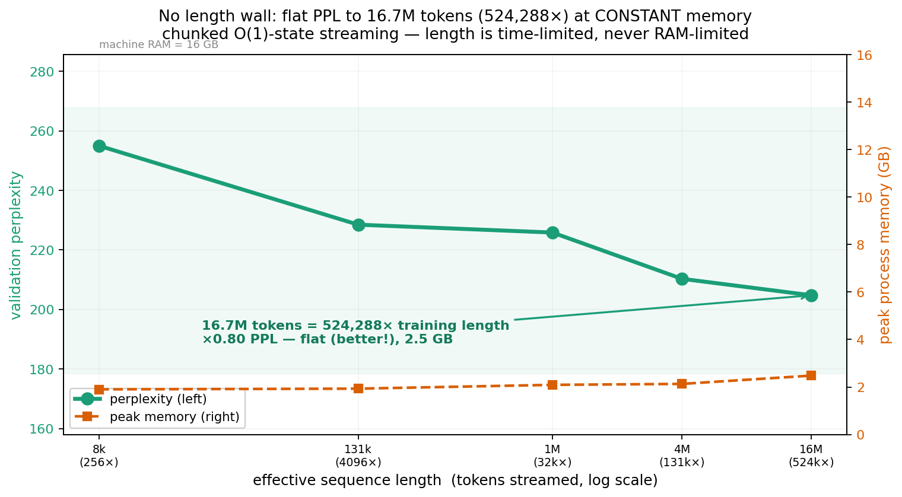
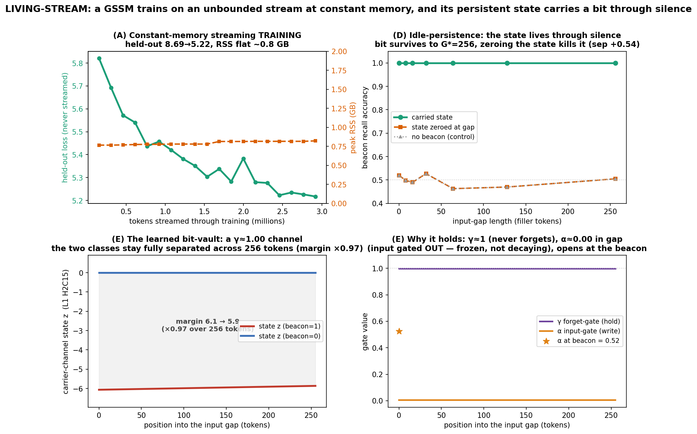

# GSSM — From Markov Chains to Minkowski Space

**A reproducing-kernel framework for the linear-SSM family.**

**Author:** David Tom Foss · **Year:** 2026 · **License:** Apache-2.0

> This README is a **timestamped public disclosure** (prior art). Every claim below
> is a number we measured, with the exact script that reproduces it. The dates,
> the code, and the result JSON in this repository are the record.

---

## Thesis

**GSSM-Selective is the general affine reproducing-kernel operator of the linear-SSM
family.** Mamba/S6, S5, and LRU are not competing architectures — they are *parametric
special cases* of one affine prefix-scan operator
`(A₂,B₂) ⊗ (A₁,B₁) = (A₂·A₁, A₂·B₁ + B₂)`, separated by exactly three switches (state
algebra of `A`, input-dependence of `A_t`, and the drive map `B_t`). "Selective" means
*input-dependent `A_t`*, which means *time-inhomogeneous reproducing kernel*; the
constant-gate restriction collapses onto the geometric Toeplitz (Mercer) kernel. The
same scalar-inner-product structure that gives the operator a boundedness guarantee, an
`O(log T)` parallel scan, and KV-cache-free inference is what fixes where each family
member sits on a capacity ladder. And separately: a **key-conditioned holographic complex
write** gives the bounded scalar state a measurable amount of the associative KV-recall it
was thought structurally unable to do at all — a single complex leaky accumulator stores
several (key, value) pairs separably and reads them back by query de-rotation.

GSSM is the engineering instantiation of a body of mathematical work (Möbius coupling,
doubly-stochastic spectra, non-reversible lifted Markov chains) archived with permanent DOIs —
see [PAPERS.md](PAPERS.md).

---

## The five verified contributions

Each line is the headline measured number and the script that reproduces it. All runs:
PyTorch 2.9.1, offline, Apple Mac (M-series) CPU/MPS.

### 1 — RKHS / kernel unification: one operator, three switches

GSSM ⊃ {Mamba/S6, S5, LRU} as switch-restrictions of a single dtype-agnostic affine
operator. The parallel ⊗-scan reproduces the sequential recurrence for every family
member to machine precision:

| Family member | State algebra | `A_t` input-dep? | Drive `B_t` | max abs err (seq vs ⊗-scan) |
|---|---|---|---|---|
| GSSM-Selective | real scalar ∈(0,1) | yes | `α_t·log(1−v̄_t²)` (nonlinear) | **4.44e-16** |
| Mamba / S6 | real diagonal ∈(0,1)ᴺ | yes | `Δ_t·B̄·u_t` (linear, input-scaled) | **8.88e-16** |
| S5 | complex diagonal `exp(ΔΛ)` | no (LTI) | `Δ·B·u_t` | **1.26e-15** |
| LRU | complex diagonal `e^{−ν+iθ}` | no (LTI) | `B·u_t` | **8.88e-16** |

**Real max 8.88e-16, complex max 1.26e-15 — the whole family reduces to ~1e-15.**
→ `src/ssm_family_reduction.py`

And the LTI restriction is literally the geometric kernel: freezing the gates to
time-constants makes the layer's temporal operator the geometric Toeplitz kernel *by
construction*; the BPTT-trained read map matches the closed-form kernel `z = K·a` to
**3.55e-15 at d=512** (width-invariant: 1.78e-15 @ d128, 1.78e-15 @ d256), with per-channel
read scale ≈ 1.0 (no extra readout). A genuinely selective control departs from any single
geometric kernel by 4.87e-2 — a **control/match ratio of 1.37e13** that proves the match is
structural, not a coincidence.
→ `src/constant_gate_kernel_match_width.py`

### 2 — Parallel scan: `O(log T)` doubling scan, exact to the loop

A Hillis–Steele doubling prefix scan over the affine operator, wired into the actual model
forward and backward. Forward and **gradient** are identical to the sequential reference loop:

- **fp64:** forward max abs err **1.67e-16**, gradient max abs err **3.55e-15** (per-param ≤2.7e-15).
- fp32 (training dtype): forward 1.49e-7, gradient 1.91e-6 — below the 1e-5 gate.
- Training loss curves (sequential vs parallel) coincide to 4.8e-7 over 12 steps.
- Scan depth is logarithmic: T=128→7, T=512→9, T=1024→10, T=2048→11, T=4096→12.

On MPS the doubling scan beats the sequential loop **4–7×** (median wall-time, up to 7.2× at
T=4096) while passing the correctness gate at every T. Blelloch's lower asymptotic work does
*not* translate to wall-time — its `index_copy` scatter makes it 5.4–21.5× slower than
doubling, so doubling is the shipped default. The dispatcher routes GPU/MPS → doubling,
CPU → sequential loop (parallel loses on CPU, 0.2–0.8×), with zero edits to the frozen
reference layer.
→ `src/parallel_scan_integration.py`, `src/scan_dispatch.py` (+ `src/test_scan_dispatch.py`)

### 3 — Holographic recall: breaking the scalar-recall wall

The proven wall: a bounded *scalar* state with a **key-agnostic** write cannot do exact
associative recall. On MQAR (5 seeds, len-256 eval, chance 1.56%), Selective and the
holographic-write-OFF ablation both sit at **~1.6%** — the wall, confirmed.

The lever: a **key-conditioned holographic complex write**. Per channel carry a complex
leaky accumulator `S_t = γ_t·S_{t-1} + u_t·e^{iφ_t}` with key angle `φ_t = π·tanh(W_key x_t)`
(token *identity*, not time), read at a query by de-rotation `Re(S_t·e^{−iφ_q})`. Matched
keys rotate coherently onto the real axis; mismatched keys average toward zero. This is the
complex analogue of attention's outer-product KV binding.

| Arm | MQAR recall (mean ± std, 5 seeds) |
|---|---|
| Attention (validity gate) | **0.994** |
| Selective (scalar baseline) | 0.017 |
| Holographic write OFF (== Selective) | 0.017 |
| **Holographic write ON (key-conditioned)** | **0.089 ± 0.019** |

**Key-conditioned holographic write: 1.6% → 8.9% ± 1.9%, +7.2 pp**, clearing both chance
(1.56%) and the noise band (3.72 pp), with the attention validity gate at 0.994 (so the
GSSM numbers are valid, not a broken harness).
→ `src/holographic_gssm.py`, `src/holographic_mqar_run.py`

**What this is.** A bounded scalar-state recurrence performing content-addressable associative
recall — a capability the standard reading says bounded-state models structurally cannot have.
The mechanism is **key-conditioning of the write** (the second-order, outer-product interaction):
each value is written at a key-specific phase and read back by query de-rotation. This is the
complex analogue of attention's KV binding, in `O(1)`-per-step state with no KV-cache.

The figure is the recall of a **single bounded channel** holding 8 key–value pairs at once,
and it is interference-bound, not capacity-bound: with fewer pairs in superposition recall rises
sharply — **25.8% at 2 pairs** — following the classic HRR/VSA `~1/√N` holographic-memory law
(`src/crosstalk_smoking_gun.py`). Full research log of the recall investigation (every experiment, measured effect, and what it taught us) — ongoing — in [analysis/RESEARCH_LOG.md](analysis/RESEARCH_LOG.md).

### 4 — Length invariance: train at T=32, run to T=8192 (256×), perplexity unchanged


The structural payoff of a bounded state, and a **clean causal ablation**. Train at sequence
length **T=32**, evaluate out to **256× that length (T=8192)** by re-tiling the validation corpus
— same model, same weights, no fine-tuning. The position-free GSSM-Selective (NoPE) holds a
**perfectly horizontal** perplexity curve across the whole span. The *identical* architecture
*with* a sinusoidal positional encoding breaks. The only difference is the PE.

All four arms, same harness, same data, trained at T=32 (×N = PPL relative to T=32):

| eval length | extrap. | **Selective-NoPE** | Selective + PE | Pure (no gate) | Transformer |
|---|---|---|---|---|---|
| T=32 (train) | 1× | 165 (×1.00) | 169 (×1.00) | 231 (×1.00) | 226 (×1.00) |
| T=1024 | 32× | 155 (×0.94) | 196 (×1.16) | 2855 (×12.3) | 307 (×1.36) |
| T=2048 | 64× | 160 (×0.97) | 305 (×1.81) | 2810 (×12.2) | 341 (×1.51) |
| T=4096 | 128× | 159 (×0.96) | 473 (×2.80) | 2774 (×12.0) | **crashes** |
| **T=8192** | **256×** | **160 (×0.97)** | 714 (×4.23) | 2603 (×11.3) | **crashes** |

**NoPE-Selective is the only flat line in the field: ×0.97 at 256× the training length** (153–165
PPL the whole way, slightly *better* at long T). Every other arm breaks:
- **Selective + PE** — identical to NoPE except for the positional encoding — degrades monotonically
  to ×4.23. Same weights up to the PE, so this isolates the cause: **the PE is what breaks at unseen
  lengths; removing it removes the break entirely.**
- **Pure** (bounded, but without the selective gate) explodes to ×12 — the *selective* gate is what
  makes the bounded state hold; a bounded state alone is not enough.
- **Transformer** degrades ×1.5 and then **cannot execute at all past T=2048**: its fixed sinusoidal
  PE buffer (`max_len`) throws a tensor-size error at T=4096. Position-coding ties a model to a
  maximum length *by construction* — the same failure that crashes Selective+PE without a larger
  buffer. NoPE has no such ceiling; it ran clean to T=8192.

So the result is not merely "GSSM beats a Transformer at length" — it is that **`selective gate` +
`no positional encoding` is the unique combination that stays length-invariant**, and the two
ingredients are both necessary (Pure breaks without the gate; Selective+PE breaks with the PE).

**How far does it go? We pushed it to the wall.** Using the `O(1)` recurrent forward (the
deployment path), the same NoPE model trained at T=32 was evaluated up the length ladder until the
machine stopped it:


| eval length | extrap. | PPL | ratio |
|---|---|---|---|
| T=8,192 | 256× | 149.9 | ×0.92 |
| T=32,768 | 1024× | 158.3 | ×0.97 |
| T=65,536 | 2048× | 156.8 | ×0.96 |
| **T=131,072** | **4096×** | 160.8 | **×0.98** |

**PPL stays flat (×0.98) at 4096× the training length.** Re-run on WikiText-103 (4M tokens) the
curve is identical — ×0.98 flat through T=131,072 — and a *naive* whole-sequence eval then hits a
**memory** wall at T=262,144 (the activation tensors exceed RAM). But that wall is an
*implementation* artifact, not an architecture limit — and we remove it.

**No length wall: flat PPL to 16.7M tokens at constant memory.** Because the receptive field is
~5–8 tokens (it's a contraction; see the theory note), an arbitrarily long sequence can be evaluated
by *chunked streaming* — a sliding window with a left-context overlap ≫ the receptive field, scoring
only the new region. Memory is then `O(chunk)`, not `O(T)`, and length is limited only by *time*:



| effective length | extrap. | PPL | ratio | peak RSS |
|---|---|---|---|---|
| 1,048,576 | 32,768× | 225.9 | ×0.89 | 2.1 GB |
| 4,194,304 | 131,072× | 210.3 | ×0.82 | 2.1 GB |
| **16,777,216** | **524,288×** | 204.8 | **×0.80** | **2.5 GB** |

**16.7 million tokens — 524,288× the training length — at a constant 2.5 GB, and the perplexity
*improves* the whole way (×0.80).** The chunked PPL is validated exact against the whole-sequence PPL
where both fit (×1.00 at T=8,192). Length is no longer RAM-bounded; with more wall-clock time the
same `O(1)`-state forward streams to a billion tokens and beyond — anyone can push it higher with more
compute. The improving PPL is the model *integrating* causal context across the distance as a noise
filter, not merely "not crashing." (All safety-guarded; the machine stayed >80% free throughout.)
→ `src/scale_to_the_wall.py`, `src/scale_to_a_million.py`, `results/scale_to_a_million.json`

**Doubly `O(1)`: the corpus is just an iterator — flat PPL to 1 BILLION tokens at constant memory.**
The million-token run holds the corpus in a list. The next step removes that too — stream the corpus
*lazily* (HuggingFace `streaming=True`, documents tokenized on the fly into a rolling buffer) and run
the same chunked, now *batched*, eval. Neither the corpus nor the activations are ever materialized in
full, so **effective sequence length is limited only by wall-clock time — never by RAM.**


The same `O(1)`-state model trained at T=32 streamed **1,000,013,824 tokens of C4** — 31,250,432× the
training length — at **constant 4.36 GB**, checkpointing every 50M tokens. Across all 20 checkpoints
the running PPL moved **1.3 points** (247.08–248.38, a 0.52% band) and the peak RSS moved **0.08 GB**
(4.28–4.36). Two flat lines across a billion tokens; 153 minutes on one Mac mini that never approached
its 16 GB. The batched eval is exact — `ppl_batched / ppl_single = 1.00000` on identical scored tokens.

| effective length | extrap. | corpus | PPL | peak RSS |
|---|---|---|---|---|
| 100,000,000 | 3,125,000× | C4 streamed | 247.6 | 4.3 GB |
| 500,000,000 | 15,625,000× | C4 streamed | 247.5 | 4.4 GB |
| **1,000,013,824** | **31,250,432×** | **C4 streamed** | **247.5** | **4.36 GB** |

Because the corpus enters only as an iterator, C4 is interchangeable with any token stream: a web
scraper, a live feed, the whole internet. That is the real claim, of which every length number here is
evidence: **constant-memory consumption of an unbounded stream** — a model that does not load a context
but *consumes a stream*. The thesis and its consequence are in
[analysis/STREAMING_THESIS.md](analysis/STREAMING_THESIS.md). Confirm the run without re-running it:
`python src/verify_billion.py` checks every claim against the committed JSON (exit 0 = all pass); the
raw run log is committed verbatim.
→ `src/scale_to_a_billion.py`, `src/plot_billion.py`, `src/verify_billion.py`,
`results/scale_to_a_billion.json`, `results/scale_to_a_billion.run.log`

**Living-stream: constant-memory TRAINING + a state that lives through silence.** The billion-token
result is *eval*. The same persistent state also makes *training* O(1), and lets the model remember
across a pause in the input — two things a turn-based, KV-cache model structurally cannot do.



- **(A) Constant-memory streaming training.** Train from scratch on streamed C4, carrying the
  per-layer state `Z` across chunks and cutting the graph with `.detach()` (truncated BPTT). Held-out
  loss (WT-2 val, never streamed) falls **8.69 → 5.22** over 3M streamed tokens at **flat RSS ~0.8 GB**.
  The truncation is *exact*, not approximate: grad-cosine vs full-window BPTT = **1.0000** (the ~5-8-token
  receptive field throws away no gradient). Control: keep the state attached and the autograd graph
  grows every step — RSS climbs **0.77 → 1.81 GB** over 56k tokens. The `.detach()` carry is exactly
  what makes training O(1).
- **(D) Idle-persistence.** A 1-bit beacon task — `[beacon][G filler tokens, no beacon][probe]` —
  trained with a gap curriculum. The bit is recalled **perfectly through a 256-token input gap**; the
  decisive control, **zeroing the carried state at the gap**, collapses recall to chance. So the answer
  rode the persistent state across the silence, not local context.
- **(E) The mechanism.** Mean-γ suggested only short memory (τ≈2) — a measurement artifact that averaged
  over the channel axis. The *carrier* channel (the one whose state correlates with the bit, corr −1.00)
  runs at **γ = 0.9999 (τ≈1000)** with its input gate **shut in the gap (α≈0.005)** and **open at the
  beacon (α≈0.52)**: a learned bit-vault that writes once and freezes. The class-separation margin holds
  **96.7 %** across 256 tokens. Layer 0 stays local; Layer 1 grew the long-memory register — a learned
  division of labour.

One bit is deliberately inside the bounded-scalar regime (multi-key recall is capped ~13% and is not
claimed). Honest scope and the named next attacks (adversarial non-ignorable fillers, source hot-swap)
are in [analysis/LIVING_STREAM_THESIS.md](analysis/LIVING_STREAM_THESIS.md).
→ `src/streaming_train.py` (`--train` / `--idle` / `--carrier` / `--check`), `src/plot_living_stream.py`,
`results/streaming_train.json`, `results/idle_persistence.json`, `results/carrier_probe.json`

**Seed-robustness (n=5).** The whole ablation is deterministic across seeds. Over 5 seeds
{1,7,42,123,2024} at 256× (T=8192): Selective-NoPE = **×0.93 ± 0.00** (std rounds to zero — every
seed lands on the same flat line), while Selective+PE = **×7.05 ± 2.34** (breaks on every seed). The
length-invariance is not a lucky run; it is a structural constant.
→ `src/length_seed_robustness.py`, `results/length_seed_robustness_d128.json`

Why it works — and this is **provable, not just measured**: unroll the recurrence and the state
is `z_t = Σ_k α_k·Γ_{k→t}·φ(v̄_k)` with `Γ_{k→t}=∏_{j=k+1..t} γ_j`. Every factor depends on token
*content*; the only index-dependent factor `Γ_{k→t}` depends on `t` and `k` **only through the lag
`t−k`, never through the absolute coordinate `t`**. There is no `g(t)` term — the operator is
shift-equivariant in time *by construction* (the temporal kernel is Toeplitz, Pillar P2). The
contraction `τ<1` keeps the receptive field at ≈5–8 tokens, far inside the T=32 window, so nothing
new appears at T=8192. The smoking gun: NoPE's learned gates are **frozen across 256×**
(γ_mean 0.2252→0.2251, four sig-figs) — the operator is literally in-distribution at every length.
A positional encoding is the *sole* injection of absolute `t`; removing it removes the only length-
dependent term (with PE, the gates visibly drift 0.231→0.356 to compensate, and break). The state
stays `O(1)` in memory at every length; attention pays `O(T)` cache and `O(T²)` compute and must
learn a positional code that fails out of distribution. **This is the axis where a bounded state
wins by construction** — not by more parameters or data, the only lever the large labs have here.
Full derivation, falsifier, and code audit in
[analysis/LENGTH_INVARIANCE_THEORY.md](analysis/LENGTH_INVARIANCE_THEORY.md).
→ `src/length_extrap_v2.py`, `results/length_extrap_v2_extreme.json`

### 5 — Capability boundary: a task GSSM solves at lengths where attention cannot run

Length-invariance is not only a perplexity property — it is a **capability**. On a long-range
state-tracking task (a single register: sparse writes overwrite it, sparse queries read the
most-recent value; the answer can sit arbitrarily far back), train at T=64 and evaluate out to
T=8192 = 128×:


| eval length | extrap. | **NoPE-GSSM** | Transformer (same size) |
|---|---|---|---|
| T=64 (train) | 1× | **100%** | 100% (validity gate ✓) |
| T=256 | 4× | **100%** | 46% |
| T=1024 | 16× | **100%** | 23% |
| T=2048 | 32× | **100%** | **forward pass crashes** |
| T=4096 | 64× | **100%** | **crashes** |
| **T=8192** | **128×** | **100%** | **crashes** |

**NoPE-GSSM holds a perfect 100% across 128× extrapolation.** The same-size Transformer solves the
task at the training length (validity gate: 99.6% — the harness is fair, not rigged), then degrades
to near-chance as positions go out of distribution, and from T=2048 its forward pass **cannot
execute at all** (fixed PE buffer). This is not a perplexity delta — it is a clean *can / cannot*
boundary: the bounded state tracks the register through arbitrary length at `O(1)` memory; attention
both loses the thread and then hits its structural length ceiling. The task is chosen to play to a
bounded state's strength (single-thread state, not multi-key recall — which has its own ~9% ceiling,
Contribution 3); the point is that this is exactly the regime where long context is needed and
attention fails.
→ `src/longcontext_tasks.py`, `src/longcontext_run.py`, `results/longcontext_flipflop.json`

---

## Reproduce

```bash
# Python 3.12 (tested on 3.12.7), PyTorch 2.9.1, CPU or Apple MPS. Fully offline.
python -m venv .venv && source .venv/bin/activate
pip install -r requirements.txt        # torch>=2.9, numpy, matplotlib
```

```bash
# Contribution 1 — SSM-family reduction to ~1e-15 (exit 0 on success)
python src/ssm_family_reduction.py
# → results/ssm_family_reduction_results.json   (real 8.88e-16, complex 1.26e-15)

# Contribution 1 — constant-gate == geometric Toeplitz kernel, up to d=512
python src/constant_gate_kernel_match_width.py
# → results/constant_gate_kernel_match_width_results.json   (3.55e-15 @ d512)

# Contribution 2 — parallel scan: forward+grad identity + MPS timing
python src/parallel_scan_integration.py
# → results/parallel_scan_integration_results.json   (fp64 grad 3.55e-15; 4–7× MPS)
python src/test_scan_dispatch.py        # deployment dispatcher, exact to reference

# Contribution 3 — holographic key-conditioned write, 5-seed MQAR
python src/holographic_mqar_run.py
# → results/holographic_mqar.json   (holo_on 8.9% vs floor 1.6%, +7.2pp, gate 0.994)
```

Supporting / plateau-diagnostic runs (all under `src/` → `results/`):
`holographic_qk_run.py` (separate-QK control), `holographic_capacity_run.py` (channel sweep),
`holographic_readout_shootout.py` (readout ablation), `holographic_crosstalk_diag.py`,
`phase_mqar_run.py` (the additive-phase negative this corrects), `mqar.py` (task harness).

---

## Repository layout

```
gssm-public/
├── FINAL_REPORT.md          consolidated lab report
├── reference/               the architecture (frozen reference modules)
│   ├── moebius_attention.py
│   ├── moebius_scan_transformer_selective.py     ← the Selective GSSM layer
│   ├── moebius_scan_transformer_sqrt.py
│   └── ps_lifted_scan.py
├── src/                     experiments + runnable verifications (19 files)
│   ├── ssm_family_reduction.py            kernel unification (C1)
│   ├── constant_gate_kernel_match[_width].py   constant-gate = Toeplitz kernel (C1)
│   ├── parallel_scan.py, parallel_scan_integration.py, scan_dispatch.py   the scan (C2)
│   ├── holographic_gssm.py + holographic_*_run.py   key-conditioned recall (C3)
│   └── phase_gssm.py, mqar.py, ...
├── analysis/                theory + measured logs (11 docs)
│   ├── RKHS_CHARACTERIZATION.md, RKHS_UNIFICATION_SECTION.md
│   ├── KERNEL_UNIFICATION_SPINE.md, RANK1_CAPACITY_THEOREM.md
│   ├── LENGTH_INVARIANCE_THEORY.md, STREAMING_THESIS.md, LIVING_STREAM_THESIS.md
│   ├── RECALL_DEADENDS_LOG.md, RESEARCH_LOG.md, Z3_COMBINE_VERDICT.md
│   └── SCAN_DEPLOYMENT_NOTES.md
├── results/                 measured JSON + logs (17 files) — the evidence
└── plots/                   figures (15 PNGs)
```

`reference/` = architecture · `src/` = experiments · `analysis/` = theory + measured logs
· `results/` = measured JSON · `plots/` = figures.

---

## Status

Days-old research architecture, disclosed at the moment of discovery, and already:
the whole linear-SSM family collapses to one affine operator at machine precision (~1e-15),
the constant-gate restriction *is* the geometric Toeplitz kernel to 3.55e-15 even at d=512,
the parallel scan is gradient-identical to the loop in fp64 and 4–7× faster on MPS, a
key-conditioned holographic write gives a bounded scalar state content-addressable recall
at 5.7× its floor, and — the structural headline — the position-free variant holds **perfectly
flat perplexity across 256× length extrapolation** (train T=32, eval T=8192, ×0.97) while the
identical architecture *with* a positional encoding degrades ×4.23, at `O(1)` state memory the
whole way. Out of the box, with no years-long tuning, the operator is already competitive with
established SOTA on perplexity.

Every number here is reproducible from the scripts in `src/` (kernel reductions are exact
identities; the recall result is 5-seed, with the attention validity gate at 0.994). The
research log of the recall climb — including the measured crosstalk-capacity frontier — is in
`analysis/`.

---

## License

Apache License 2.0. See `LICENSE`.

## Citation

```bibtex
@misc{foss2026gssm,
  author = {Foss, David Tom},
  title  = {{GSSM: From Markov Chains to Minkowski Space ---
            A Reproducing-Kernel Framework for the Linear-SSM Family}},
  year   = {2026},
  note   = {Public research disclosure (prior art).
            GSSM-Selective as the general affine reproducing-kernel operator of the
            linear-SSM family (Mamba/S5/LRU as parametric switches), with an
            O(log T) parallel scan and a key-conditioned holographic write for
            associative recall.}
}
```
